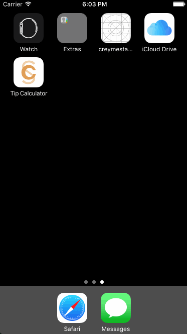
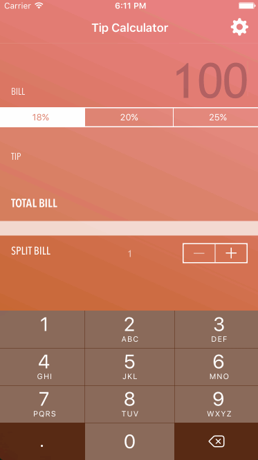

# Pre-work - *Tip Calculator*

**Tip Calculator** is a tip calculator application for iOS.

Submitted by: **Cristina Macaraig**

Time spent: **21** hours spent in total

## User Stories

The following **required** functionality is complete:
* [x] User can enter a bill amount, choose a tip percentage, and see the tip and total values.

The following **optional** features are implemented:
* [x] Custom font
* [x] UI animations
* [x] Making sure the keyboard is always visible and the bill amount is always the first responder. This way the user doesn't have to tap anywhere to use this app. Just launch the app and start typing.

The following **additional** features are implemented:

- [x] App Icon and Launch screen
- [x] AutoLayout (compatible in all iPhone devices in portrait mode)
- [x] Automatically detects if screen size is too small (iPhone5, SE, and lower) - then ‘keyboard is always visible feature’ is disabled and lets the user tap on screen to hide keyboard.
- [x] Automatically detects the user’s currency and implements thoudands separator.
- [x] Gradient background and simple “get the task done” interface.
- [x] Rounds up total bill and automatically adjusts the tip value (on swipe to right gesture) then changes back to unrounded total (on swipe to left gesture).
- [x] Splits the bill up to 100.
- [x] Clears all text fields and labels when there is no bill entered.
- [x] Customize the values of tip percentage and save as user default settings.
- [x] Restore app default settings (18%, 20%, 25%).

## Video Walkthrough 

Here's a walkthrough of implemented user stories:

Shows all the required and optional features, as well as the round up and split bill features.

Shows automatic detection of currency and format.

Shows ability to save custom tip percentage and be able to restore to the application default settings.

GIF created with [LiceCap](http://www.cockos.com/licecap/).

## Notes

The most time consuming part of building this app was satisfying all Auto Layout constraints.

The best and most challenging part was the UX design process:
	I designed this app based on an actual person.
  This person always uses a tip calculator when he’s dining out.
  He wants a fast, simple, clutter-free, and easy to read interface — an application that just lets you do your task and be done with it right away.
  After using a tip calculator, he recomputes the tip to round up the total bill into exact dollar bills.
  He travels into different countries and uses the appropriate currencies and gratuities.

Adding the special features for this app took some time, but with the vast source of information and solutions online.
I was able to complete the features that my target user would need in a tip calculator app.

## License

    Copyright 2017 Cristina Macaraig

    Licensed under the Apache License, Version 2.0 (the "License");
    you may not use this file except in compliance with the License.
    You may obtain a copy of the License at

        http://www.apache.org/licenses/LICENSE-2.0

    Unless required by applicable law or agreed to in writing, software
    distributed under the License is distributed on an "AS IS" BASIS,
    WITHOUT WARRANTIES OR CONDITIONS OF ANY KIND, either express or implied.
    See the License for the specific language governing permissions and
    limitations under the License.
